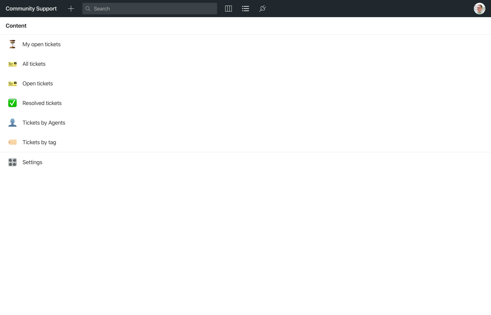
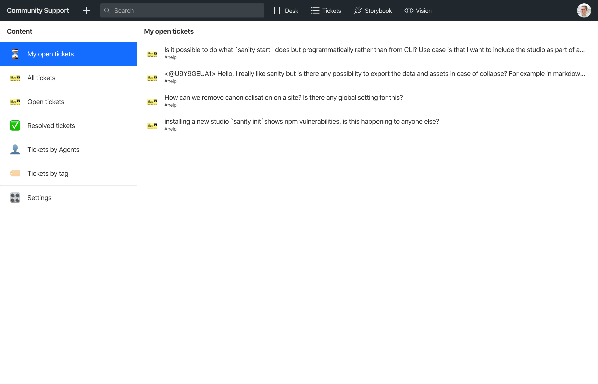
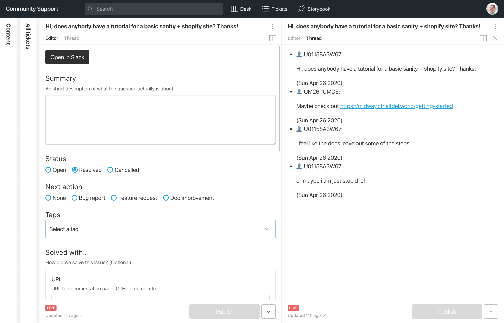
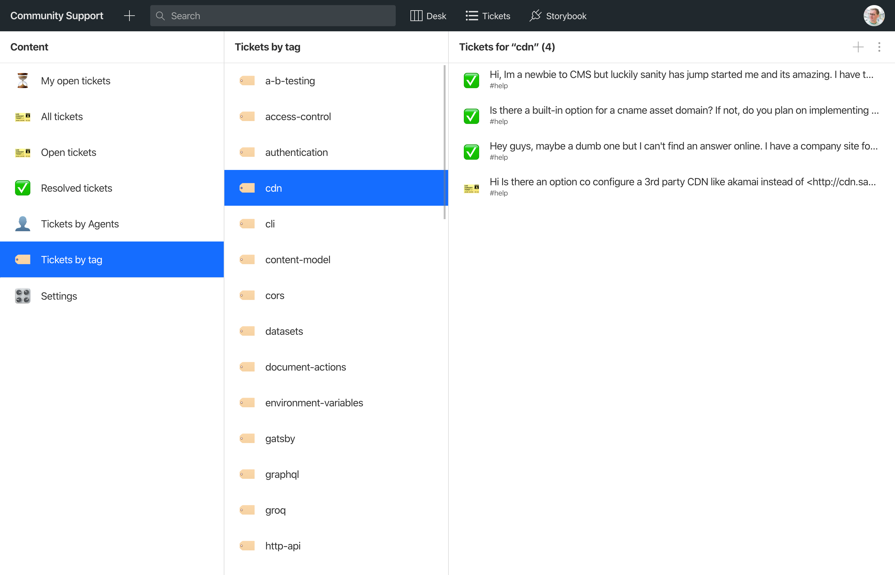
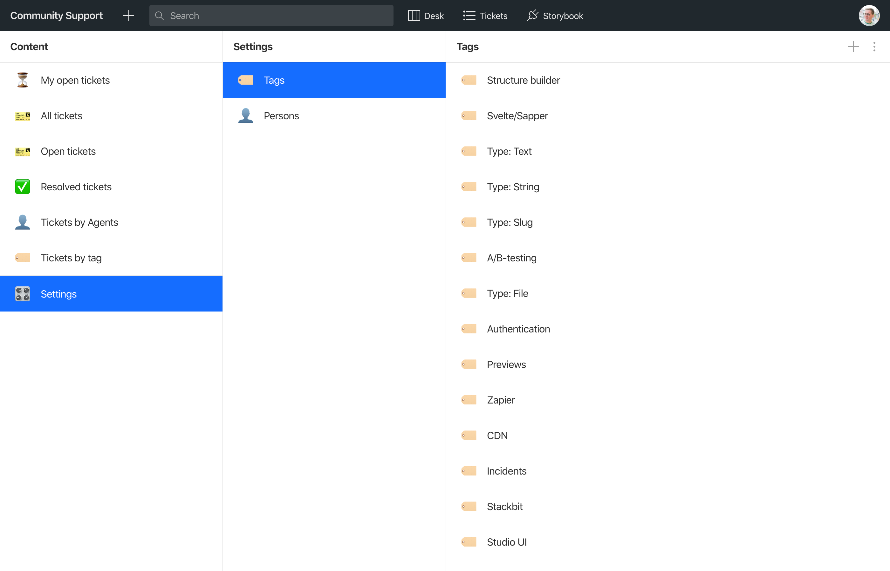
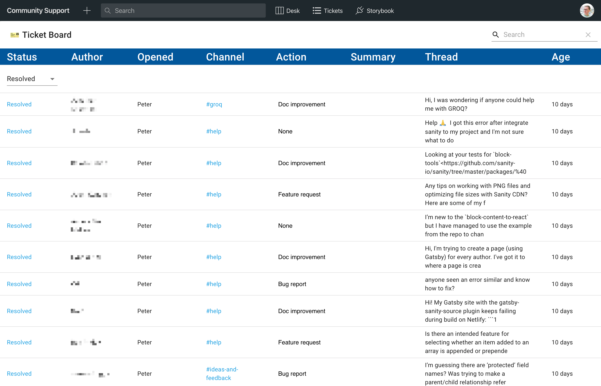
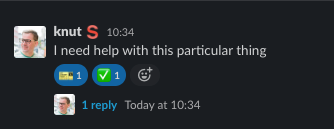

# Sanity Community Management Studio with Slack integration

[🙋🏻‍♀️ Join the Sanity.io community](https://slack.sanity.io)

This repository contains both the studio and the services for Sanity‘s community bot. It makes it possible for the Sanity team to mark questions in the community slack with a 🎫 emoji to create a ticket and track conversations in threads, and the ✅ to resolve it. By tagging tickets, this studio also works as a knowledge base to help community managers to find answers, and get insight to documentation improvements, feature requests, bug reports and so on.

It‘s used in production, but under active development.

Feel free to use this repository for inspiration, and you‘re welcome to fork it. We‘re happy to answer questions about it in the community #help-channel, but we can't support your implementation or take feature requests.

## Features

- Track messages in Slack as tickets by marking them with the 🎫 emoji
- Mark tickets as done with the ✅ emoji
- Keeps track of threads, with preview
- Scope ticket creation to an email domain
- Serverless single sign-on for Google Suite ([requires enterprise plan](https://www.sanity.io/contact), normal sign-on can also be used)
- Personalized desk structure
- Custom ticket tool for easy overview
- Custom input compoment for tags as references
- Serverless deployment on [Vercel](https://vercel.com/)

## Table of contents

- [Features](#features)
- [Table of contents](#table-of-contents)
- [Screenshots](#screenshots)
  - [The community support studio](#the-community-support-studio)
  - [Personalized tickets overview](#personalized-tickets-overview)
  - [Custom preview for Slack threads](#custom-preview-for-slack-threads)
  - [Browse tickets by tags](#browse-tickets-by-tags)
  - [Tags settings](#tags-settings)
  - [Custom ticket tool](#custom-ticket-tool)
  - [Create and resolve tickets in Slack](#create-and-resolve-tickets-in-slack)
- [Content model](#content-model)
  - [Person](#person)
  - [Ticket](#ticket)
  - [Tag option](#tag-option)
- [Local development and deployment](#local-development-and-deployment)
  - [Deploy Sanity Studio and services to Vercel](#deploy-sanity-studio-and-services-to-vercel)
  - [Slack integration](#slack-integration)
    - [Local development of Slack integration](#local-development-of-slack-integration)
  - [SSO integration for Google Suite](#sso-integration-for-google-suite)
    - [Setting up OAuth with Google Cloud](#setting-up-oauth-with-google-cloud)
    - [Disabling SSO to use standard login with Google/Github/Sanity user-pass](#disabling-sso-to-use-standard-login-with-googlegithubsanity-user-pass)

## Screenshots

### The community support studio



### Personalized tickets overview



### Custom preview for Slack threads



### Browse tickets by tags



### Tags settings



### Custom ticket tool



### Create and resolve tickets in Slack



## Content model

This content model will evolve as we add more features.

### Person

People who log in are assigned a `person` document, it is also used to reference `agent` in the tickets

Fields:

- Name
- Nickname
- Sanity ID
- Github Username
- Image
- User avatar url
- Email
- Biography

### Ticket

When you put a 🎫-emoji on a Slack message, a new `ticket` document is created and will keep track of the thread.

Fields:

- Permalink to slack message
- Short summary of the question
- Status [Open, Pending, Resolved, Cancelled]
- “Next action“: None, improve docs, feature request, or bug report
- Tags: Array of tags sourced from the `tagOption` type
- “Solved with…”, URL to Github/Docs, and short summary
- Agent, reference to the `person` on the case
- Slack channel name
- Author name for the original message author
- “Opened by”, the person placing the 🎫 emoji
- Thread: The contents of the slack thread

### Tag option

A title/value for a thematic tag that helps us group tickets for analysis and knowledge base

## Local development and deployment

### Deploy Sanity Studio and services to Vercel

This app is deployed on [Vercel](https://www.vercel.com). The easiest way to get up and running is the following

1. Install Sanity and Vercel CLIs

```bash
npm install --global @sanity/cli vercel
```

or yarn

```bash
yarn global add @sanity/cli vercel
```

2. Install dependencies in the project root folder

```bash
npm i
```

or yarn

```bash
yarn
```

3. Initiate a new Sanity project.

```bash
sanity init
```

This will create a new project ID and reconfigure `sanity.json` for you. **You should make the dataset Private**.

4. ENV variables

Open up the configuration for your new project and to to Settings -> API and create a `write` token. Save it somewhere, you'll be pasting it into a file shortly.

```bash
sanity manage
```

Copy and edit the example .env file

```bash
mv .env.template .env
```

Set it up with these variable names and values. You can find project id and dataset name in `sanity.json`

```env
SANITY_PROJECT_ID=<sanity-project-id>
SANITY_DATASET=<sanity-dataset>
SANITY_WRITE_TOKEN=<sanity write-token you just made>
```

Finally, add the secrets to your `Now` account. The keys are located in the `now.json` Nowfile.

```bash
now secrets add community-bot-sanity-project-id <sanity-project-id>
now secrets add community-bot-sanity-dataset <sanity-dataset>
now secrets add community-bot-sanity-sso-write-token <sanity-sso-write>
now secrets add community-bot-sanity-create-session-token <sanity-create-session>
now secrets add community-bot-google-oauth-secret <google-oauth-secret>
now secrets add community-bot-slack-bot-user-token <slack-bot-user>
now secrets add community-bot-sanity-email-domain <sanity-email-domain>
```

6. Create Vercel project

Go to [vercel.com/import](https://vercel.com/import) and create a new project by selecting your Github repo with this app

You need to override the following _Build and Development Settings_:

- Build command: `sanity build public -y && cp login.html public/login.html`
- Development command: `sanity start --port $PORT`

7. CORS

Add your Vercel app URL to your Sanity project‘s [CORS origins settings](https://www.sanity.io/docs/cors). You'll need to allow authenticated requests to have the Studio work.

```bash
sanity cors add <app-url>
```

If you want to be able to login to PR deployments for the Studio, you can add a wildcard CORS origin. _Be very careful_. You don‘t want to set a CORS origin for a URL other people can create:

- **Don't**: `https://*.vercel.app`
- **Do**: `https://*.your-org.vercel.app` or `https://subdomain.your-domain.tld`

### Slack integration

To set up the Slack integration you'll need to go to [api.slack.com/apps](https://api.slack.com/apps) and create a new app there.

Put in some helpful info in the **Display information** settings.

Go to the **OAuth & Permissions** settings and give it the following **Scopes**:

- Bot Token Scopes:

  - channels:history
  - channels:join
  - channels:read
  - emoji:read
  - groups:history
  - groups:read
  - reactions:read
  - users:read
  - users:read.email

- User Token Scopes:

  - channels:history
  - groups:history

- Add the following environment variables to the `.env` file:
- `SLACK_BOT_USER_TOKEN` - This is the **Bot User OAuth Access Token** under **OAuth & Permissions**
- `EMAIL_DOMAIN` - The (@)orgname.tld for email addresses in your org (e.g. `sanity.io` to restrict ticket creation to the Sanity team)

Go to the **Event Subscriptions** settings and add the following URL: `https://your-app-name.your-org.now.sh/api/events` (if you have a custom domain for your Vercel deployment, it‘s `https://your-custom-domain.tld/api/events`). _The app needs to be deployed in order for Slack to verify this endpoint._

#### Local development of Slack integration

If you want to test the Slack integration when developing locally, you'll need to pipe your `http://localhost:3000` to a public endpoint. You can use [ngrok](https://ngrok.com/) to create a secure tunnel to your localhost. You’ll need to edit the **Event Subscriptions** URL to `https://random-id-or-custom-name.ngrok.io/api/events` while you're testing. This will interupt the service if you have it production.

### SSO integration for Google Suite

This studio comes with SSO integration for Google Suite out-of-the-box.

#### Setting up OAuth with Google Cloud

You need to set up OAuth on your Google Cloud account:

- Go to the OAuth consent screen on [console.cloud.google.com](https://console.cloud.google.com/apis/credentials/consent) and add the following:
  - Application type: Internal (you probably don‘t want this to be public)
  - Application name: An approriate name
  - Application logo: Your org‘s logo
  - Scopes for Google APIs:
    - email
    - profile
    - openid
    - ../auth/analytics.readonly
    - openid
    - email
    - profile
- Authorized domains: `your-org.now.sh` (and if you have other domains you want to log in from)
- Set `Application Homepage link` and `Application Privacy Policy link` to their approriate places if you have them, or just your homepage URL

Then go to the [Credentials](https://console.cloud.google.com/apis/credentials) settings, and add a new **OAuth 2.0 Client ID**:

- Name: A regonizeable name so you know what it's for
- URIs:
  - `https://your-app-name.your-org.now.sh`
  - `http://localhost:3000`
- Authorized redirect URIs
  - `https://your-app-name.your-org.now.sh`
  - `http://localhost:3000`

The you'll need to copy-paste the **Client Id** and the **Client secret** and add it to your environment variables (`.env` locally):

- `SANITY_CREATE_SESSION_TOKEN` - For SSO (requires a business or enterprise plan](https://www.sanity.io/contact)) Go to the API settings and create a token with “Create session” access.
- `CLIENT_ID=<the google OAuth client ID>` (this isn't a secret and will be exposed publicly)
- `CLIENT_SECRET=<the google OAuth client secret>`
- `SANITY_STUDIO_URL=https://your-app-name.your-org.now.sh`

Replace the value for `client_id:` in `login.html` with your Google’s OAuth client ID.

#### Disabling SSO to use standard login with Google/Github/Sanity user-pass

You can disable the SSO feature, and use the standard login options. You then need to create the `person` documents manually and add their `Sanity ID` to enable the “My tickets” feature.

- Delete `api/verify-token.ts` (or rename to `api/_verify-token.ts` to disable it)
- Go to `config/@sanity/default-login.json` and replace it with the following:

```json
{
  "providers": {
    "mode": "append",
    "redirectOnSingle": false,
    "entries": []
  }
}
```

To find the project‘s user ids, make sure you're logged in to the project (e.g. in manage.sanity.io), and open these URLs in your browser (it will use the cookie‘s authentication token):

- `https://api.sanity.io/v1/projects/<projectId>` - ids in in the `members` array.
- You can look up a member on this endpoint: `https://api.sanity.io/v1/projects/<projectId>/users/<userId>`
